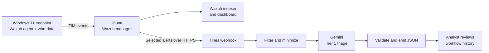
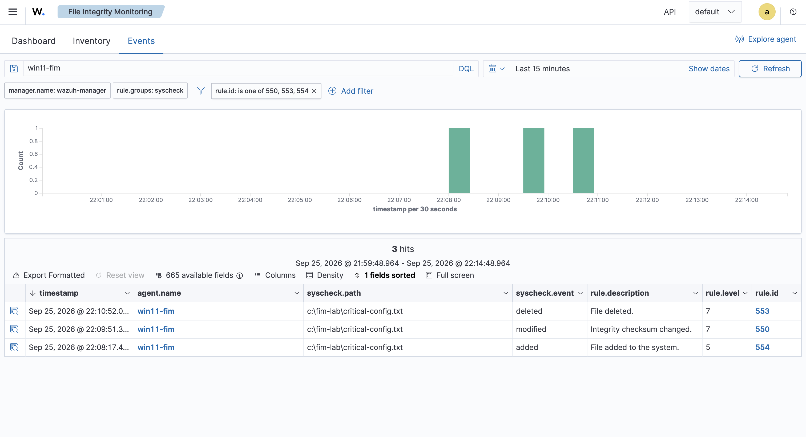
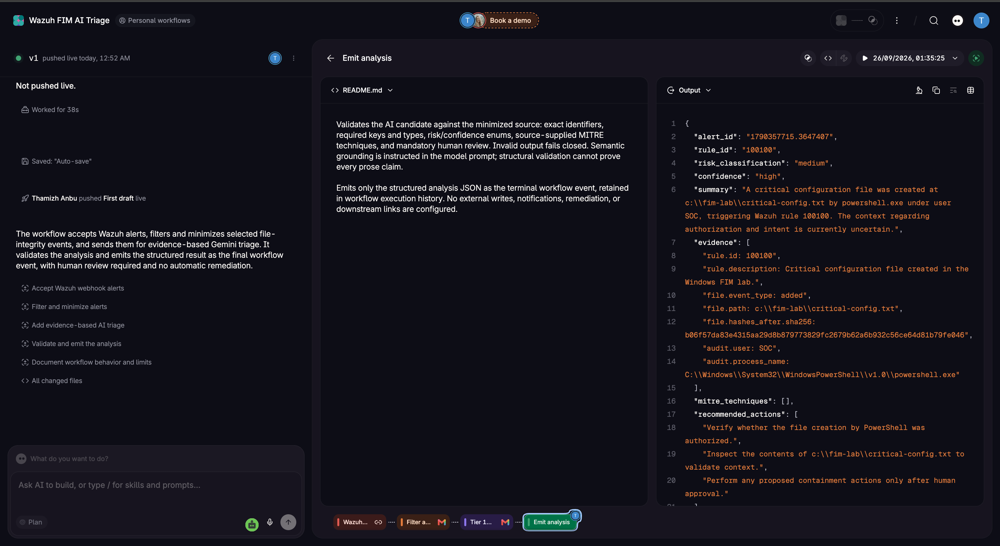
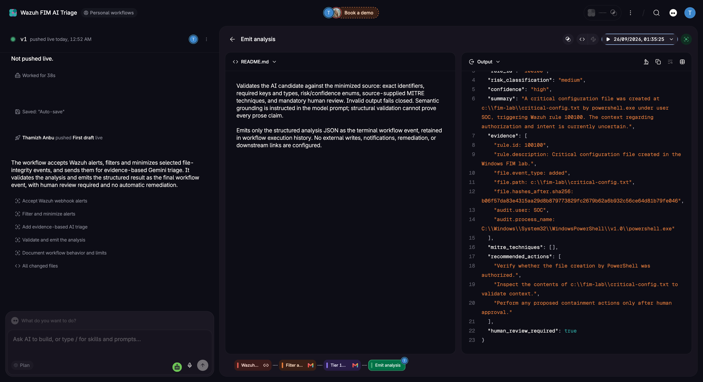

# Windows File Integrity Monitoring with Wazuh and AI-Assisted Triage

**A security monitoring lab that turns Windows file changes into evidence-based triage for analyst review.**

I configured Wazuh to monitor a Windows lab directory, created three detection rules, and connected selected alerts to a Tines workflow using Google Gemini. A live file-creation alert was traced from the endpoint through Wazuh to a structured AI analysis with matching alert and rule identifiers.

**Status:** working lab demonstration. Live AI processing is evidenced for file creation; live modification and deletion runs remain to be captured. This is an analyst-assistance workflow, with no automated containment.

## Problem and approach

A file-integrity alert tells an analyst that something changed. Initial triage also needs context: which file, which user and process, what changed, and what to check next. This project combines deterministic detection with AI-generated explanation while retaining the original evidence and requiring human review.



The forwarding script sends the **full matching alert to Tines**. Field minimization takes place there, before the Gemini request. The original webhook input remains in Tines execution history. [Architecture and data flow](docs/architecture.md)

## What I implemented

- Central Windows FIM configuration for `C:\FIM-Lab`, including content-change reporting and who-data attribution.
- Custom rules for creation (`100100`), modification (`100101`), and deletion (`100102`) of `critical-config.txt`.
- A Python integration that forwards selected Wazuh alerts to an authenticated Tines webhook.
- A four-stage workflow: receive → filter/minimize → Gemini analysis → validate/emit.
- Structured results containing risk, confidence, evidence, recommended actions, and `human_review_required: true`.

The workflow was developed with AI assistance. Configuration, troubleshooting, tests, and output review are documented here. The exported live workflow source is still pending; reference code is explicitly labelled rather than presented as the deployed source.

## Evidence and results

| Check | Evidence-supported result |
|---|---|
| Windows agent enrollment | Agent `win11-fim` is active in Wazuh |
| File monitoring | Added, modified, and deleted events appear in the Wazuh event table |
| User/process context | A modification alert includes who-data, PowerShell attribution, and changed attributes |
| Custom detections | Rules are configured and the dashboard shows activity with the three custom rule IDs selected |
| Live forwarding | Wazuh records successful forwarding of rule `100100` |
| Live AI result | Final output contains the same alert ID, rule `100100`, medium risk, high model-reported confidence, and human review required |
| Negative-input handling | Draft validation reports rejection of malformed/missing JSON and filtering of rule `554`; raw test traces remain to be exported |

**Live correlation:** the supplied webhook-input screenshot and final analysis show alert `1790357715.3647407`. The selected folder contains the final output; a clean source-input capture still needs to be added for readers to verify both ends directly. A sender success log alone establishes HTTP delivery, not AI completion.

### Detection and analyst context



### Live AI triage



### Human review requirement



[Annotated evidence index](docs/evidence.md) · [Test results and remaining tests](docs/testing-and-results.md)

## Explore the implementation

| Material | Purpose |
|---|---|
| [Configuration](config/) | Central FIM settings, custom rules, and a placeholder-only integration block |
| [Scripts](scripts/) | Reconstructed forwarding logic, a proposed safer sender, and repeatable lab actions |
| [Samples](samples/) | Synthetic data for offline inspection and testing |
| [Code walkthrough](docs/code-walkthrough.md) | Why the important settings and code exist |
| [Deployment guide](docs/deployment.md) | Order of operations, validation commands, and rollback |
| [Code validation](docs/code-validation.md) | Offline tests and their scope |
| [Design decisions and gaps](docs/limitations-and-roadmap.md) | Tradeoffs and the next engineering steps |
| [Interview notes](docs/interview-guide.md) | A concise explanation of the project and technical questions |

Run the reference tests locally with Python 3, from the repository root:

```bash
python3 -m unittest discover -s tests -v
```

These tests use synthetic data and mocks. They do not send alerts to a live webhook or prove the deployed Tines implementation.

## Important boundaries

The AI risk classification is an assessment, not a verdict. Model-reported confidence is not a calibrated probability. A filename or custom rule description containing “critical” does not independently establish asset importance, and MITRE labels are detection context rather than proof of an attack.

`human_review_required` is an advisory output field; there is no enforced approval queue. Delivery retries, durable buffering, deduplication, alert notifications, and SIEM writeback are not implemented. See the roadmap for the next engineering steps.

## References

- [Wazuh custom integrations](https://documentation.wazuh.com/current/user-manual/manager/integration-with-external-apis.html)
- [Wazuh file-integrity monitoring settings](https://documentation.wazuh.com/current/user-manual/reference/ossec-conf/syscheck.html)
- [Wazuh advanced FIM configuration](https://documentation.wazuh.com/current/user-manual/capabilities/file-integrity/advanced-settings.html)
- [Gemini API billing and tier behavior](https://ai.google.dev/gemini-api/docs/billing)

All activity was performed in a personal lab. Public files contain example configuration and selected screenshots, not credentials or a working webhook URL.
